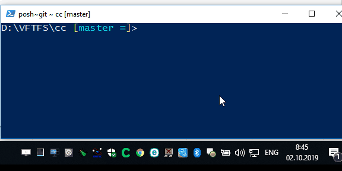

# ConnectionChecker
Connection checker for location with poor internet connection (train for example).

Based on functions: 
* [ConvertTo-Icon](https://www.powershellgallery.com/packages/RoughDraft/0.1/Content/ConvertTo-Icon.ps1)
* [Invoke-BalloonTip](https://github.com/honzakuzel1989/PowerShell_Scripts/blob/master/Invoke-BalloonTip.ps1)
